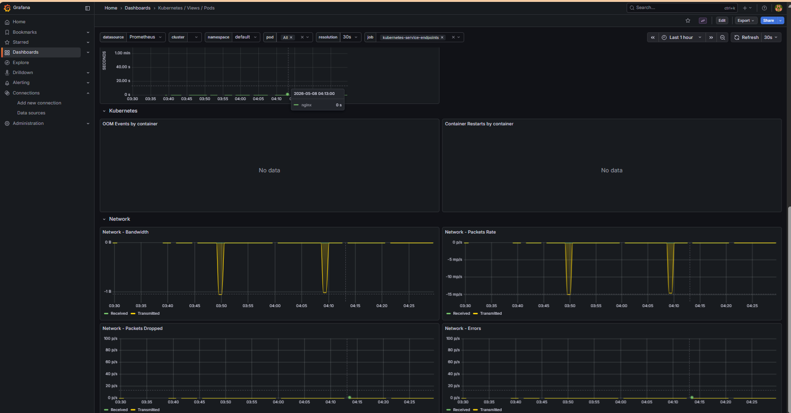

# Kubernetes SRE Lab - Infrastructure as Code

[](https://github.com/denoso1993/k8s-portfolio-iac)
[](https://kubernetes.io/)
[](https://www.terraform.io/)

## Arquitetura do Cluster


## Visao Geral

Este repositorio documenta minha jornada pratica com **Kubernetes e Site Reliability Engineering (SRE)**, evoluindo de conceitos basicos ate implementacoes **production-ready** com infraestrutura 100% declarativa via Terraform.

### O Que Este Projeto Demonstra

- **Cluster Kubernetes Local**: Kind (Kubernetes in Docker) totalmente funcional
- **Auto-Scaling**: HPA configurado para escalar de 1-5 replicas (70% CPU)
- **Seguranca**: ResourceQuota, LimitRange e NetworkPolicies implementados
- **Observabilidade Completa**: Prometheus + Grafana + Loki stack
- **Banco de Dados**: PostgreSQL com StatefulSet e persistencia
- **GitOps Ready**: Estrutura preparada para CI/CD

## Arquitetura Implementada

| Componente | Tecnologia | Status |
|------------|------------|--------|
| Orquestracao | Kubernetes (Kind v1.27.3) | Ready |
| IaC | Terraform + Helm | 100% declarativo |
| Web Server | Nginx (ConfigMap-based) | Desacoplado |
| Database | PostgreSQL 15 (StatefulSet) | PVC persistencia |
| HPA | Horizontal Pod Autoscaler | 1-5 replicas (70%) |
| Metricas | Prometheus + Metrics Server | Ativo |
| Logs | Loki + Promtail | Centralizado |
| Dashboards | Grafana | Provisionado |
| Seguranca | NetworkPolicy + Quotas | Implementado |

## Stack de Monitoramento



## Seguranca e Governanca

### ResourceQuota (Namespace: default)
- **CPU**: 4 cores request / 8 cores limit
- **Memoria**: 4Gi request / 8Gi limit
- **Pods**: 20 max
- **Services**: 10 max

### LimitRange (Padroes para Containers)
- **Default CPU**: 500m
- **Default Memory**: 512Mi
- **Request CPU**: 100m
- **Request Memory**: 128Mi

### NetworkPolicies Ativas
- `default-deny-all`: Bloqueia todo trafego por padrao (zero-trust)
- `allow-dns`: Permite DNS apenas para kube-system
- `nginx-allow-ingress`: Permite trafego na porta 80 do nginx

## Como Usar

### Pre-requisitos
- WSL2 (Ubuntu 20.04+)
- Docker Desktop
- Kind
- Terraform 1.6+
- kubectl

### Deploy do Cluster
```bash
git clone https://github.com/denoso1993/k8s-portfolio-iac.git
cd k8s-portfolio-iac
./setup.sh
terraform init
terraform apply
kubectl get nodes
```

### Acessando as Aplicacoes
| Aplicacao | Porta Local | NodePort |
|-----------|-------------|----------|
| Nginx (Portfolio) | 8081 | 30000 |
| Grafana | 3000 | 30001 |
| Prometheus | 9090 | - |

## Operacao

### Status Atual do Cluster

```text
NAMESPACE    NAME                      READY   STATUS
default      nginx-deployment          1/1     Running
default      postgres-sts-0            1/1     Running
monitoring   grafana                   1/1     Running
monitoring   prometheus-server         2/2     Running
monitoring   loki-stack                1/1     Running
kube-system  metrics-server            1/1     Running
```

### Comandos Uteis

```bash
# Status do cluster
kubectl get all -A

# Ver HPA
kubectl get hpa

# Ver pods
kubectl get pods -A

# Logs
kubectl logs -f deploy/nginx-deployment
```

## Roadmap

### Concluido (Fase 1 - Fundamentos)
- [x] Cluster Kind operacional
- [x] HPA configurado (70% CPU, 1-5 replicas)
- [x] Security hardening completo
- [x] Stack de monitoramento (Prometheus + Grafana + Loki)
- [x] PostgreSQL StatefulSet
- [x] Stress tests validados

### Em Andamento (Fase 2 - Produtividade)
- [ ] k9s + Stern para operacao
- [ ] Goldilocks para recommendations
- [ ] Dashboards Grafana customizados

### Planejado (Fase 3 - CI/CD)
- [ ] GitHub Actions workflows
- [ ] Validacao automatica de PRs
- [ ] Deploy automatico

### Futuro (Fase 4 - GitOps)
- [ ] ArgoCD
- [ ] Sync automatico
- [ ] Image automation

## Metricas do Projeto

| Metrica | Status |
|---------|--------|
| Uptime Cluster | ~99% |
| Resource Utilization | Otimizado (70% target) |
| IaC Coverage | 100% |
| HPA Status | 0%/70% (1/5 replicas) |
| Ultima Atualizacao | 2026-05-10 |

## Sobre o Autor

**Denis Oliveira Ramos**  
Senior Cloud Analyst | SRE & Infrastructure  
Barueri, SP - Brasil

Atuo com infraestrutura cloud e automacao, focando em praticas de SRE e Infrastructure as Code. Este projeto documenta minha jornada e serve como referencia para outros profissionais.

### Links
- **LinkedIn:** [linkedin.com/in/denis93](https://linkedin.com/in/denis93)
- **Curriculo PT-BR:** [Google Drive](https://drive.google.com/file/d/11fzA0o9tvPZmhhwIsCuknAiWwu8YIlkJ/view)
- **Curriculo EN:** [Google Drive](https://drive.google.com/file/d/1Yhzihbq8T9fV_U4FzxqY1EDke4dhgNUS/view)
- **Certificados:** [Pasta Completa](https://drive.google.com/drive/folders/1k_4mO-j4WEoaIGngR9cGLX1WpVSKC-AD)

---

*Projeto de portfolio pessoal - Denis Oliveira Ramos*